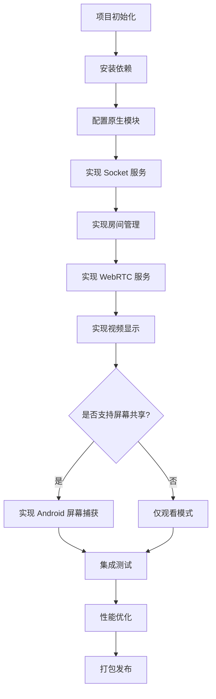

# React Native 移动端实施计划

## 1. 开发阶段划分

### 阶段一：项目初始化（1-2天）

#### 任务清单
- [ ] 创建 React Native 项目
- [ ] 配置 TypeScript
- [ ] 安装核心依赖
- [ ] 配置 Metro 打包工具
- [ ] 链接 shared 共享包
- [ ] 配置 ESLint 和 Prettier

#### 初始化命令
```bash
# 创建项目
npx react-native init ScreenSharingMobile --template react-native-template-typescript

# 安装核心依赖
npm install react-native-webrtc socket.io-client zustand
npm install @react-navigation/native @react-navigation/stack
npm install react-native-screens react-native-safe-area-context
npm install react-native-gesture-handler react-native-reanimated
npm install react-native-paper react-native-vector-icons
npm install react-native-permissions

# 链接共享包
npm link ../shared
```

---

### 阶段二：基础功能开发（3-4天）

#### 任务清单
- [ ] 实现 Socket 服务连接
- [ ] 实现导航结构
- [ ] 创建首页（创建/加入房间）
- [ ] 创建房间页面骨架
- [ ] 实现用户列表组件
- [ ] 实现房间状态管理

#### 页面结构
```
首页 (HomeScreen)
├── 创建房间入口
├── 加入房间入口
└── 设置入口

房间页面 (RoomScreen)
├── 视频网格区域
├── 用户列表
└── 控制栏
```

---

### 阶段三：WebRTC 集成（3-4天）

#### 任务清单
- [ ] 实现 PeerConnectionManager
- [ ] 实现 WebRTC 服务层
- [ ] 处理 Offer/Answer 信令
- [ ] 处理 ICE 候选交换
- [ ] 实现远程流接收和显示
- [ ] 实现视频网格组件

#### 关键代码路径
- `src/services/webrtc/WebRTCService.ts`
- `src/services/webrtc/PeerConnectionManager.ts`
- `src/screens/Room/hooks/useRoomWebRTC.ts`
- `src/components/VideoGrid/index.tsx`

---

### 阶段四：屏幕共享功能（3-4天）

#### 任务清单
- [ ] 创建 Android 原生模块 (ScreenCaptureModule)
- [ ] 实现 MediaProjection 权限请求
- [ ] 实现屏幕捕获服务
- [ ] 集成捕获流到 WebRTC
- [ ] 实现共享控制 UI
- [ ] 测试屏幕共享流程

#### Android 原生开发
```
android/app/src/main/java/com/screensharing/
├── MainApplication.java (注册原生模块)
├── MainActivity.java
└── modules/
    └── ScreenCaptureModule.java (屏幕捕获模块)
```

---

### 阶段五：优化和完善（2-3天）

#### 任务清单
- [ ] 实现自适应码率
- [ ] 添加网络质量监控
- [ ] 优化视频渲染性能
- [ ] 完善错误处理
- [ ] 添加日志记录
- [ ] UI/UX 细节优化

---

### 阶段六：测试和发布（2-3天）

#### 任务清单
- [ ] 编写单元测试
- [ ] 多设备真机测试
- [ ] 修复兼容性问题
- [ ] 配置签名和打包
- [ ] 生成 APK 安装包
- [ ] 编写使用文档

---

## 2. 代码开发优先级

### P0 - 必须实现
| 功能 | 文件 | 说明 |
|------|------|------|
| Socket 连接 | `src/services/socket/SocketService.ts` | 与服务器通信 |
| 房间管理 | `src/store/useRoomStore.ts` | 创建/加入房间 |
| WebRTC 连接 | `src/services/webrtc/WebRTCService.ts` | P2P 连接管理 |
| 视频显示 | `src/components/VideoGrid/index.tsx` | 显示远程流 |

### P1 - 重要功能
| 功能 | 文件 | 说明 |
|------|------|------|
| 屏幕共享 | `src/services/screenCapture/ScreenCaptureService.ts` | Android 屏幕捕获 |
| 权限管理 | `src/services/permission/PermissionService.ts` | 权限请求处理 |
| 用户列表 | `src/components/UserList/index.tsx` | 显示房间成员 |

### P2 - 优化功能
| 功能 | 文件 | 说明 |
|------|------|------|
| 自适应码率 | `src/utils/adaptiveBitrate.ts` | 动态调整质量 |
| 网络监控 | `src/hooks/useNetworkQuality.ts` | 连接质量监控 |
| 性能优化 | `src/utils/performance.ts` | 性能工具函数 |

---

## 3. 开发流程图



---

## 4. 技术实现要点

### 4.1 Socket 服务初始化
```typescript
// App.tsx 中初始化 Socket
import { SocketService } from './services/socket/SocketService';
import { SERVER_URL } from './utils/constants';

const socketService = new SocketService(SERVER_URL);

useEffect(() => {
  socketService.connect();
  return () => socketService.disconnect();
}, []);
```

### 4.2 WebRTC 配置
```typescript
// src/utils/constants.ts
export const RTC_CONFIG = {
  iceServers: [
    { urls: 'stun:stun.l.google.com:19302' },
    { urls: 'stun:stun1.l.google.com:19302' },
  ],
};

export const SERVER_URL = __DEV__ 
  ? 'http://192.168.1.100:3000'  // 本地开发
  : 'https://your-production-server.com';
```

### 4.3 视频流渲染
```typescript
// src/components/VideoStream/index.tsx
import { RTCView } from 'react-native-webrtc';

export const VideoStream = ({ stream }) => (
  <RTCView
    streamURL={stream.toURL()}
    style={{ flex: 1 }}
    objectFit="cover"
  />
);
```

---

## 5. 测试清单

### 功能测试
- [ ] 创建房间成功
- [ ] 加入房间成功（有密码/无密码）
- [ ] 离开房间正常清理资源
- [ ] 接收并显示远程屏幕流
- [ ] 发起屏幕共享（Android）
- [ ] 多人同时观看

### 兼容性测试
- [ ] Android 7.0+ 各版本测试
- [ ] 不同屏幕尺寸适配
- [ ] 不同网络环境测试（WiFi/4G/5G）

### 性能测试
- [ ] 内存使用监控
- [ ] CPU 占用监控
- [ ] 长时间运行稳定性

---

## 6. 风险与应对

| 风险 | 概率 | 影响 | 应对措施 |
|------|------|------|---------|
| react-native-webrtc 兼容问题 | 中 | 高 | 锁定稳定版本，充分测试 |
| Android 权限拒绝 | 高 | 中 | 详细的权限引导说明 |
| 网络不稳定导致断连 | 高 | 中 | 实现自动重连机制 |
| 内存泄漏 | 中 | 高 | 严格资源释放，监控内存 |

---

## 7. 验收标准

### 基础功能验收
- ✅ 能够成功连接到服务器
- ✅ 能够创建/加入房间
- ✅ 能够看到房间内其他用户
- ✅ 能够接收并显示远程屏幕共享
- ✅ 能够发起屏幕共享（Android）

### 性能验收
- ✅ 应用启动时间 < 3秒
- ✅ 视频延迟 < 500ms
- ✅ 内存占用 < 300MB（观看2路流）
- ✅ CPU占用 < 30%（正常使用）

---

## 8. 下一步行动

准备就绪后，请切换到 **Code 模式** 开始实施：

1. 创建 `mobile/` 目录
2. 初始化 React Native 项目
3. 按照阶段计划逐步开发

是否确认此设计方案并开始开发？
